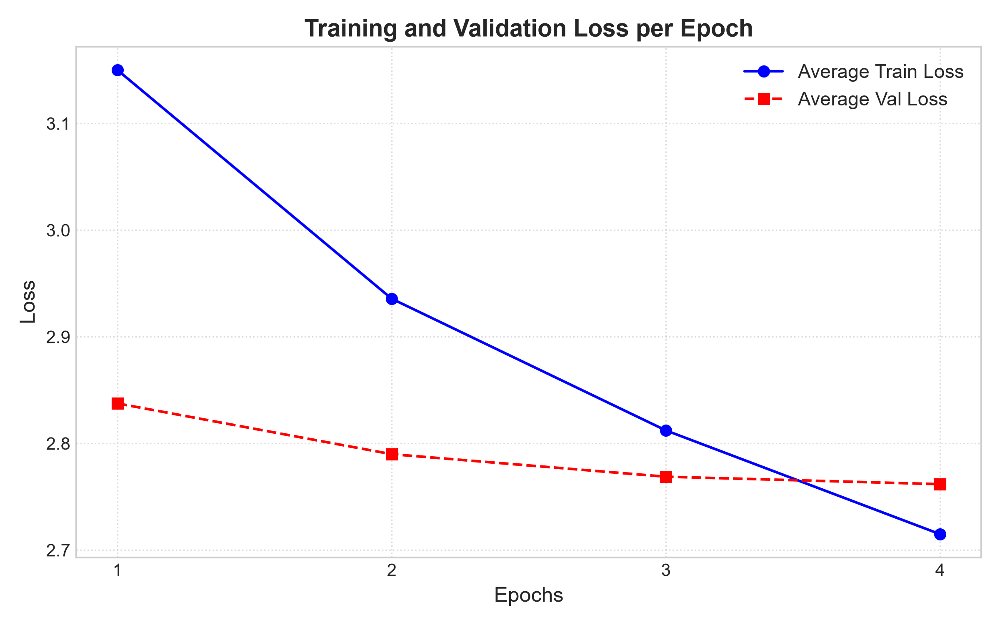
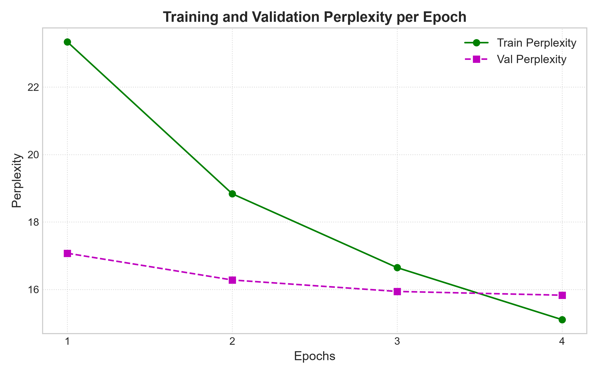

# GPT-2 Instruct Model Fine-tuning

This project fine-tunes the GPT-2 instruct model on the Databricks Dolly-15k dataset for instruction-following tasks.

## Model & Dataset

- **Base Model**: [FurkanNar/GPT-2_Instruct-v0.1](https://huggingface.co/FurkanNar/GPT-2_Instruct-v0.1)
- **Training Datasets**: The model was trained on **3 datasets**:
  - [tatsu-lab/alpaca](https://huggingface.co/datasets/tatsu-lab/alpaca) - Instruction-following dataset
  - [ChilleD/SVAMP](https://huggingface.co/datasets/ChilleD/SVAMP) - Math word problems
  - [databricks/databricks-dolly-15k](https://huggingface.co/datasets/databricks/databricks-dolly-15k) - Diverse instruction dataset
- **Total Training Samples**: Combined samples from all three datasets

## Training Hyperparameters

| Parameter | Value |
|-----------|-------|
| Max Sequence Length | 128 tokens |
| Epochs | 4 |
| Batch Size | 4 |
| Learning Rate | 2e-5 |
| Max Gradient Norm | 1.0 |
| Mixed Precision | FP16 (enabled) |
| GPU Memory Fraction | 50% |

## Training Results

### Epoch Summaries

| Epoch | Train Loss | Train Perplexity | Val Loss | Val Perplexity |
|-------|------------|------------------|----------|----------------|
| 1 | 3.1501 | 23.3380 | 2.8375 | 17.0723 |
| 2 | 2.9357 | 18.8347 | 2.7899 | 16.2790 |
| 3 | 2.8122 | 16.6459 | 2.7688 | 15.9397 |
| 4 | 2.7149 | 15.1032 | 2.7618 | 15.8282 |

### Loss Progress



The model shows consistent improvement in both training and validation loss across all epochs. The validation loss decreases from 2.8375 to 2.7618, indicating the model is learning effectively without significant overfitting.

### Perplexity Progress



Perplexity follows a similar downward trend, with training perplexity dropping from 23.34 to 15.10 and validation perplexity from 17.07 to 15.83. The narrowing gap between training and validation perplexity suggests the model is generalizing well.

## Model Artifacts

The trained model is saved locally in the `saved_model/` directory:
- `model.safetensors` - Model weights in safetensors format
- `config.json` - Model configuration
- `generation_config.json` - Generation parameters

## Training Configuration

The training script includes several optimizations for memory efficiency:
- Mixed precision training (FP16) to reduce memory usage
- Gradient clipping to prevent exploding gradients
- GPU memory fraction limiting to 50% to prevent OOM errors
- Memory fragmentation reduction via `PYTORCH_CUDA_ALLOC_CONF=expandable_segments:True`
- Cooling delays between training phases to prevent GPU overheating

## Inference

The model uses a sophisticated **Best-of-N sampling** approach with multiple advanced techniques for high-quality generation:

### Generation Method

- **Parallel Batched Generation**: Generates N candidates (default N=4) in parallel via GPU batching for efficiency
- **Length-Normalized Log-Likelihood Scoring**: Each candidate is scored using temperature-scaled logits, computing the geometric mean of token probabilities normalized by sequence length to eliminate short-response bias
- **Calibrated Confidence Selection**: Uses a separate calibration temperature (T_calib=1.0) for scoring, independent from generation temperature (T_gen=0.7), allowing separate control over exploration and confidence estimation

### Sampling Parameters

| Parameter | Value | Description |
|-----------|-------|-------------|
| Generation Temperature | 0.7   | Controls randomness during candidate generation |
| Calibration Temperature | 0.8    | Scales logits for confidence scoring |
| Top-K | 40    | Limits sampling to top K tokens per position |
| Top-P (Nucleus) | 0.9   | Cumulative probability threshold for sampling |
| Repetition Penalty | 1.15  | Penalizes repeated tokens to reduce redundancy |
| No Repeat Ngram Size | 3     | Prevents repeating 3-token sequences |
| Max New Tokens | 100   | Maximum response length |

### Multi-Turn Conversation

- **Conversation History**: Maintains turn-by-turn history using Dolly-15k/Alpaca format with "Instruction:" and "Response:" tags
- **Context Management**: Automatically truncates earlier conversation turns when context exceeds max_length (512 tokens)
- **Stop Sequences**: Custom stopping criteria prevent over-generation by detecting sequences like "\nInstruction:", "\nResponse:", "\nUser:", etc.

### Example Output

```
You: How to make a salad

--- Best-of-4 Candidate Scores ---
 * Candidate 1: Log-Likelihood = -1.1720 | Geom Mean Prob = 31.0% (100 tokens)
   Candidate 2: Log-Likelihood = -1.1942 | Geom Mean Prob = 30.3% (100 tokens)
   Candidate 3: Log-Likelihood = -1.5361 | Geom Mean Prob = 21.5% (100 tokens)
   Candidate 4: Log-Likelihood = -1.2042 | Geom Mean Prob = 30.0% (100 tokens)
-------------------------------------------------------
AI: First, you need your lettuce slice, which will be placed on top of the mashed potatoes.
Next, you'll want to prepare some vegetables.  You can use carrots or celery sticks for this type because carrots are tough but celery stick is soft so you'll need it in place.  Next, add water to these vegetables.
Finally, mix everything together with olive oil or butter and let it cook for 5-6 minutes. This way, you don't have to worry about
```

### Known Weaknesses

- **Tight Clusters**: The model may generate similar responses across candidates, especially when the training data has limited diversity in certain domains. This can reduce the effectiveness of the Best-of-4 method when candidates are too similar.

- **GPT-2 Base Knowledge Limitations**: Since this model is based on GPT-2 (124M parameters), it has inherent limitations in base knowledge compared to larger models like GPT-3 or GPT-4. The model may:
  - Struggle with complex reasoning tasks
  - Have limited world knowledge and factual accuracy
  - Produce hallucinations or incorrect information
  - Have difficulty with specialized domains not well-represented in the training data

- **Sequence Length Constraint**: The model is trained with a max sequence length of 128 tokens, which limits the length and complexity of responses it can generate effectively.